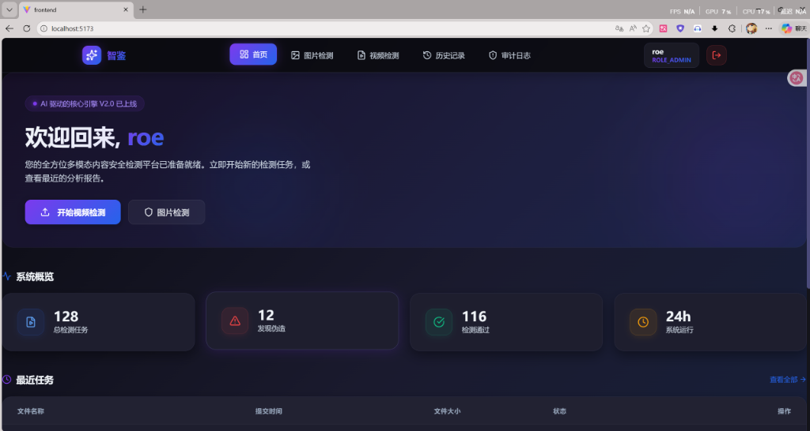
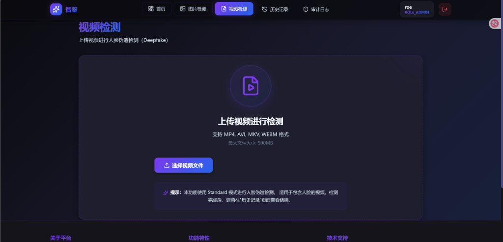
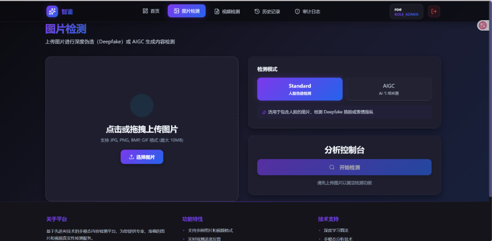
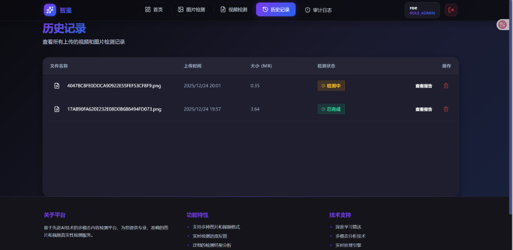
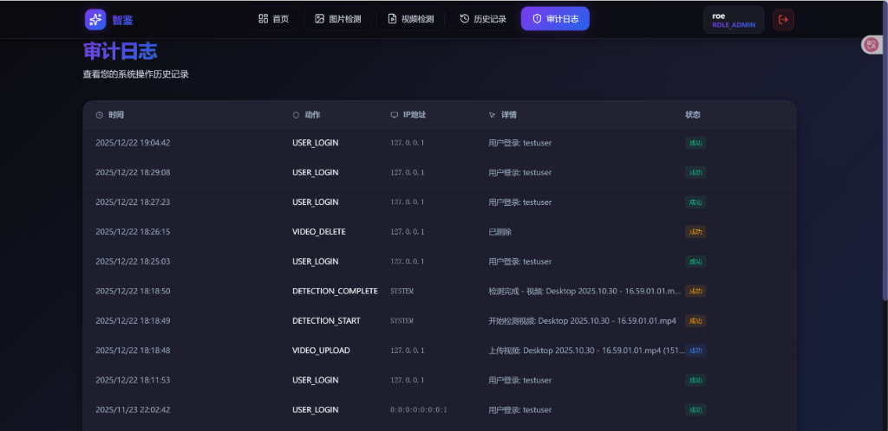

# Video Detection System

A deep learning-based video deepfake detection system supporting Deepfake and AIGC content detection.


[](https://www.oracle.com/java/)
[](https://spring.io/projects/spring-boot)
[](https://reactjs.org/)
[](LICENSE)

## 📋 Project Introduction

Video Detection System is an enterprise-grade video deepfake detection platform with a microservices architecture, integrating advanced deep learning models (Effort, DRCT), and providing comprehensive video upload, detection, result analysis, and audit functionality.

### Key Features

- 🎯 **Dual-Mode Detection**: Support for facial forgery detection (Deepfake) and universal generated content detection (AIGC)
- 🏗️ **Microservices Architecture**: 6 independent microservices, easy to extend and maintain
- 🔐 **Secure Authentication**: JWT-based user authentication and authorization mechanism
- 📊 **Real-time Notifications**: WebSocket real-time push of detection progress and results
- 📝 **Complete Audit**: Detailed operation logs and audit trails
- 🎨 **Modern Frontend**: Responsive user interface built with React + Vite
- 🐳 **Containerized Deployment**: Complete Docker Compose configuration
 
 ## 🖼️ System Demo
 
 ### 1. Dashboard
 
 
 ### 2. Video Detection
 
 
 ### 3. Image Detection
 
 
 ### 4. History
 
 
 ### 5. Audit Log
 

## 🏛️ System Architecture

```
┌─────────────┐
│   Frontend  │ (React + Vite)
└──────┬──────┘
       │
┌──────▼──────────────────────────────────────────┐
│              API Gateway (Nginx)                 │
└──────┬──────────────────────────────────────────┘
       │
┌──────▼──────────────────────────────────────────┐
│                 Microservices                    │
├──────────────┬──────────────┬────────────────────┤
│ Auth Service │Video Service │Detection Service   │
│   (9001)     │   (9002)     │     (9004)         │
├──────────────┼──────────────┼────────────────────┤
│Worker Service│WebSocket Svc │ Audit Service      │
│   (9003)     │   (9005)     │     (9006)         │
└──────────────┴──────────────┴────────────────────┘
       │              │              │
┌──────▼──────┐ ┌────▼────┐  ┌──────▼──────┐
│  PostgreSQL │ │  Kafka  │  │    Redis    │
│   (5432)    │ │ (19092) │  │   (6379)    │
└─────────────┘ └─────────┘  └─────────────┘
       │
┌──────▼──────────────┐
│  AI Detection       │ (Python Flask)
│   Service           │
│    (5000)           │
└─────────────────────┘
```

## 🚀 Quick Start

### Prerequisites

- **Java 17+**
- **Maven 3.8+**
- **Node.js 18+**
- **Docker & Docker Compose**
- **PostgreSQL 15+**
- **Python 3.10** (for AI services)
- **CUDA 11.3+** (optional, for GPU acceleration)

### Installation Steps

1. **Clone the repository**
   ```bash
   git clone https://github.com/yourusername/video-detection-system.git
   cd video-detection-system
   ```

2. **Start the infrastructure**
   ```bash
   # Windows
   .\start-infra.ps1
   
   # Linux/Mac
   docker-compose -f docker-compose-infra.yml up -d
   ```

3. **Initialize the database**
   ```bash
   # Windows
   .\scripts\init-database.ps1
   
   # Linux/Mac
   bash scripts/init-database.sh
   ```

4. **Build the backend services**
   ```bash
   mvn clean package -DskipTests
   ```

5. **Start the microservices**
   ```bash
   # Start services in the following order
   # 1. auth-service
   # 2. video-service
   # 3. worker-service
   # 4. detection-service
   # 5. websocket-service
   # 6. audit-service
   ```

6. **Start the frontend**
   ```bash
   cd frontend
   npm install
   npm run dev
   ```

7. **Configure and start the AI detection service**
   ```bash
   # Refer to the AI Environment Configuration section below
   ```

8. **Access the system**
   - Frontend: http://localhost:5173
   - Test account: admin / 123456

## 📚 Documentation

- [API Documentation](docs/API接口文档.md) - Complete REST API documentation
- [AI Client API](docs/AI_Client_API_Documentation.md) - AI detection service interface
- [Scripts Usage Guide](docs/SCRIPTS.md) - Tool scripts usage guide
- [Port Migration Guide](docs/PORT_MIGRATION.md) - Port configuration change record

## 🛠️ Technology Stack

### Backend
- **Framework**: Spring Boot 3.2.0, Spring Cloud
- **Database**: PostgreSQL 15
- **Message Queue**: Apache Kafka 7.5.0
- **Cache**: Redis 7.0
- **Authentication**: JWT (JSON Web Token)
- **API Documentation**: OpenAPI 3.0

### Frontend
- **Framework**: React 18.3.1
- **Build Tool**: Vite 6.0
- **Router**: React Router 7.1
- **HTTP Client**: Axios 1.7
- **Styling**: CSS Modules

### AI Service

#### Runtime Environment
- **Python**: 3.10
- **Deep Learning Framework**: PyTorch 2.1.1
- **Models**: Effort (Deepfake detection), DRCT (AIGC detection)
- **Service Framework**: Flask
- **Compute Acceleration**: CUDA 11.3+ (GPU)

#### Environment Configuration

**1. Create Python Virtual Environment**
   ```bash
   # Create virtual environment
   python3.10 -m venv venv
   
   # Activate virtual environment
   # Windows
   venv\Scripts\activate
   
   # Linux/Mac
   source venv/bin/activate
   ```

**2. Install Dependencies**

   ```bash
   # PyTorch 2.1.1 (CUDA 11.8)
   pip install torch==2.1.1 torchvision==0.16.1 torchaudio==2.1.1 --index-url https://download.pytorch.org/whl/cu118
   
   # Basic scientific computing libraries
   pip install numpy==1.21.5
   pip install pandas==1.4.2
   pip install scipy==1.7.3
   
   # Image processing
   pip install Pillow==9.0.1
   pip install opencv-python==4.6.0.66
   pip install imageio==2.9.0
   pip install imgaug==0.4.0
   pip install scikit-image==0.19.2
   pip install albumentations==1.1.0
   
   # Deep learning model libraries
   pip install efficientnet-pytorch==0.7.1
   pip install timm==0.6.12
   pip install segmentation-models-pytorch==0.3.2
   pip install torchtoolbox==0.1.8.2
   
   # Face detection
   pip install dlib==19.24.0
   
   # Image processing tools
   pip install imutils==0.5.4
   pip install tqdm==4.61.0
   
   # Data processing and visualization
   pip install seaborn==0.11.2
   pip install scikit-learn==1.0.2
   
   # Configuration and logging
   pip install pyyaml==6.0
   pip install setuptools==59.5.0
   
   # Web framework and tools
   pip install flask
   pip install tensorflow  # Optional, may be required for some models
   
   # Monitoring and visualization
   pip install tensorboard==2.10.1
   
   # Advanced deep learning features
   pip install loralib
   pip install einops
   
   # NLP and multimodal models
   pip install transformers
   pip install git+https://github.com/openai/CLIP.git
   
   # Computer vision tools
   pip install filterpy
   pip install kornia
   pip install fvcore
   
   # Data processing
   pip install simplejson
   ```

**3. Verify Installation**
   ```bash
   python -c "import torch; print(f'PyTorch version: {torch.__version__}')"
   python -c "import cv2; print(f'OpenCV version: {cv2.__version__}')"
   python -c "import transformers; print('Transformers installed successfully')"
   ```

**4. Start the AI Detection Service**
   ```bash
   # Ensure the virtual environment is activated
   python ai_service/app.py
   
   # Or use Flask development server
   flask --app ai_service.app run --port 5000
   ```

> **Note**: This open-source version does not include the complete AI detection service core code (closed-source). The project provides a `scripts/mock-ai-service.py` script for demonstrating system functionality. This script simulates the detection process and returns random results.

### DevOps
- **Containerization**: Docker, Docker Compose
- **Build Tool**: Maven
- **Version Control**: Git

## 📦 Project Structure

```
video-detection-system/
├── auth-service/          # Authentication service
├── video-service/         # Video management service
├── worker-service/        # Task processing service
├── detection-service/     # Detection service
├── websocket-service/     # WebSocket notification service
├── audit-service/         # Audit logging service
├── common-lib/            # Common library
├── ai-client/             # AI service client
├── frontend/              # React frontend
├── scripts/               # Utility scripts
├── docs/                  # Documentation
├── docker-compose.yml     # Docker orchestration configuration
└── pom.xml                # Maven parent POM
```

## 🔧 Configuration Guide

### Environment Variables

Key configuration items (need to be modified according to your actual environment):

```yaml
# Database configuration
POSTGRES_USER: admin
POSTGRES_PASSWORD: your-password  # Corresponds to POSTGRES_PASSWORD in backend configuration
POSTGRES_DB: video_detection

# JWT secret
JWT_SECRET: your-secret-key       # Corresponds to JWT_SECRET in backend configuration

# AI service address
AI_SERVICE_URL: http://localhost:5000
```

### Port Configuration

| Service | Port | Description |
|---------|------|-------------|
| auth-service | 9001 | Authentication service |
| video-service | 9002 | Video service |
| worker-service | 9003 | Task processing |
| detection-service | 9004 | Detection service |
| websocket-service | 9005 | WebSocket |
| audit-service | 9006 | Audit service |
| PostgreSQL | 5432 | Database |
| Kafka | 19092 | Message queue |
| Redis | 6379 | Cache |
| AI Service | 5000 | AI detection |

## 🧪 Testing

```bash
# Run unit tests
mvn test

# Run integration tests
mvn verify

# Frontend tests
cd frontend
npm test
```

## 📊 Performance Metrics

- **Detection Speed**: Average 1-3 seconds per video (depends on video length and hardware)
- **Concurrent Processing**: Support for multi-task concurrent detection
- **Accuracy**: Deepfake detection accuracy >90% (based on Effort model)

## 🤝 Contribution Guidelines

Contributions are welcome! Please follow these steps:

1. Fork this repository
2. Create a feature branch (`git checkout -b feature/AmazingFeature`)
3. Commit your changes (`git commit -m 'Add some AmazingFeature'`)
4. Push to the branch (`git push origin feature/AmazingFeature`)
5. Open a Pull Request

## 📝 License

This project is licensed under the MIT License - see the [LICENSE](LICENSE) file for details

## 👥 Authors

- **RoeAcg** - Initial work
- **Natsuki-nanami** - Algorithm reasoning framework

## 🙏 Acknowledgments

- [DeepfakeBench](https://github.com/SCLBD/DeepfakeBench) - Deep learning model benchmark
- Effort - [Orthogonal Subspace Decomposition for Generalizable AI-Generated Image Detection](https://arxiv.org/abs/2411.15633)
- DRCT - Diffusion Reconstruction Contrastive Training towards Universal Detection of Diffusion Generated Images
- Spring Boot Community
- React Community

## 📮 Contact Information

- Project Homepage: [https://github.com/RoeAcg/Video-Detection-System](https://github.com/RoeAcg/Video-Detection-System)
- Issue Feedback: [https://github.com/RoeAcg/Video-Detection-System/issues](https://github.com/RoeAcg/Video-Detection-System/issues)

---

**Note**: This project is for learning and research purposes only. Please do not use for illegal purposes.
